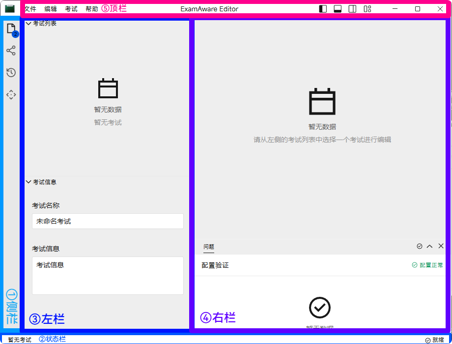
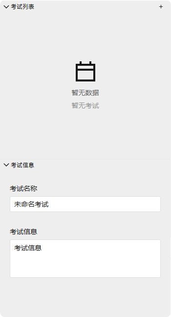
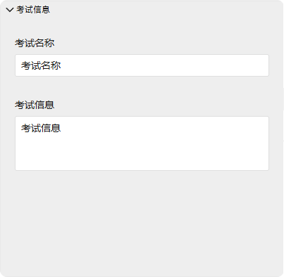

# 编辑器

::: tip 总览

本页面将教会您如何使用 ExamAware 2 的编辑器。

:::

## 启动编辑器

::: info

接下来的部分将以运行在 Windows™ 11 25H2 的 ExamAware 2 v1.2.1 (马路) 作为例子。在其它系统上可能有些许不同，但软件功能部分没有差异。

:::

通过点击主界面中的绿色（与此同时下方注明 `编辑器` 的）按钮，您可以启动编辑器。在这之后一般可以见到如下的界面：

它们可以被分为 5 个部分：

- ① [侧栏](./editor.md#侧栏)
- ② [状态栏](./editor.md#状态栏)
- ③ [左栏](./editor.md#左栏)
- ④ [右栏](./editor.md#右栏)
- ⑤ [顶栏](./editor.md#顶栏)

## 功能介绍

### 侧栏

侧栏从上至下分别有四个按钮，分别对应：

- 资源管理器 (Explorer)
- 就近共享 (Sharing)
- 操作记录 (History)
- 插件 (Plugins)

点击各个按钮，可以切换[左栏](./editor.md#左栏)中显示的内容。

### 状态栏

状态栏显示了当前的操作状态。左侧是当前编辑的考试信息，右侧是目前编辑器的状态，例如是否就绪等。

### 左栏

左栏随侧栏按钮的点击而切换其显示的内容。

| 资源管理器                                        | 就近共享                                     | 操作记录                                       | 插件                                       |
| ------------------------------------------------- | -------------------------------------------- | ---------------------------------------------- | ------------------------------------------ |
|  |  |  |  |

#### 资源管理器

资源管理器包含两行：**考试列表** 与 **考试信息**。打开一个考试文件后，考试列表会显示当前目录下的所有考试文件，而考试信息则会显示考试的详细信息。

点击这两行左上方的展开/收起按钮，将会展开/收起这两行的内容。

##### 考试列表

您可以在这里查看考试组中所有测试。通过点击右上角的加号来新建一场测试。点击编辑或直接单击测试项目可以在右栏中编辑测试的详细信息。点击右侧三个点可以多单个测试进行更多操作。

::: important

在不能分辨下文两个概念时，我们有时称包含许多场的考试为 **考试组**，而单独的一场考试则称为 **测试**。比如，“期终考试”就是一个考试组，而“期终考试中的语文考试”就是一个测试。对应在软件中，则考试列表中包含了所有测试，而考试信息则显示了考试组的信息。

这里提到的内容，以后将不再赘述。

:::

##### 考试信息

您可以在这里查看考试组的详细信息。这些信息将在放映时被显示。

#### 就近共享

您可以在这里启用或禁用“就近共享”功能。开启后，您可以在局域网内共享配置。

#### 操作记录

您可以在这里查看最近的操作记录。若不小心误操作，可以在这里撤回。

#### 插件

您可以在这里使用插件的各类功能。请参阅各个插件的文档来了解更多。

### 右栏

### 顶栏
