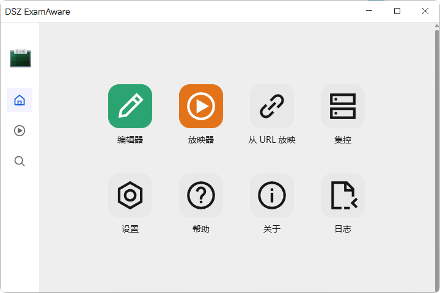
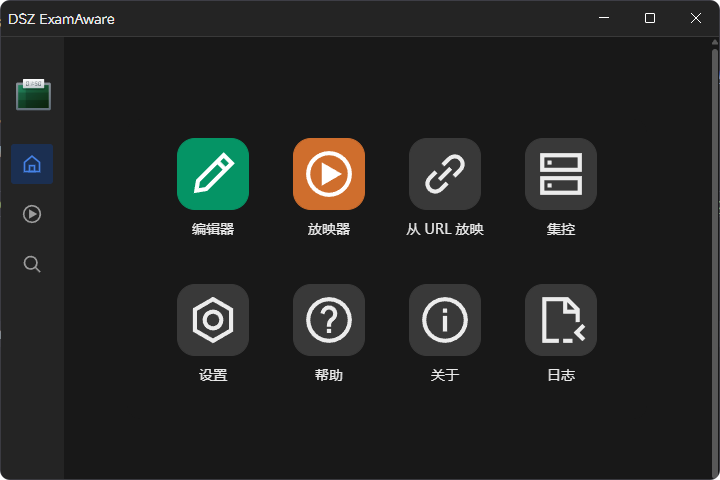

# 快速开始

::: tip 总览
本页面将教会你如何在计算机上开始使用 ExamAware 2。
:::

## 系统需求

下载 ExamAware 2 前，请确保您的系统满足如下需求：

### 操作系统与架构

ExamAware 2 支持以下操作系统与架构：

| 操作系统                                                                                          | 架构               |
| ------------------------------------------------------------------------------------------------- | ------------------ |
| Windows™ 10 1803 或更高版本                                                                       | x86, x86_64, arm64 |
| macOS™ 12 (Monterey) 或更高版本                                                                   | 仅 x86_64          |
| Ubuntu 18.04 (及其衍生版本) 或更高版本; Fedora 32 或更高版本; Debian 10 (及其衍生版本) 或更高版本 | x86_64             |

::: tip

我们还推荐您的机器满足以下性能要求以流畅运行 ExamAware 2：

- 2 GHz 或更快的处理器
- 4 GiB 以上的 RAM
- 4 GiB 以上的可用磁盘空间
- 支持 DirectX 9 的显卡

:::

::: warning

- 我们暂未提供针对 macOS™ 和使用 arm64 架构的 Windows™ 系统的安装程序，您需要自行构建本应用并安装。

:::

## 下载与安装

您可以从以下链接下载 ExamAware 2：

- [GitHub Releases](https://github.com/ExamAware/ExamAware2/releases/latest)
- [GitHub Actions](https://github.com/ExamAware/ExamAware2/actions/workflows/release.yml)

### 从 GitHub Releases 下载

1. 打开 [ExamAware 2 的 GitHub Releases 页面](https://github.com/ExamAware/ExamAware2/releases/latest)。
2. 找到与您的系统对应的安装程序，并下载到本地。
   - 比如，若您使用 Windows™ 系统，请下载`ExamAware-x.x.x-setup.exe`（其中x.x.x对应版本号）。
3. 打开下载的安装程序，按照提示进行安装。

### 从 GitHub Actions 下载

1. 打开 [ExamAware 2 的 GitHub Actions 页面](https://github.com/ExamAware/ExamAware2/actions/workflows/release.yml)。
2. 在右侧找到最新的带有绿色对勾标记的工作流程运行，并打开它。
3. 在左侧的“所有作业”或“All jobs”中，找到与您的操作系统对应的作业，并点击它。
   - 比如，若您使用 Windows™ 系统，请找到`Build Windows Latest`作业。
4. 在右侧作业详情中，展开“Upload artifacts to workflow”。
5. 找到与 `Artifact download URL: https://github.com/ExamAware/ExamAware2/actions/runs/xxxxxx/artifacts/xxxxxx`（其中xxxxxx对应数字）相似的行。这里的网址即是您需要下载的安装程序。

## 基本使用

安装完成后，打开 ExamAware 2。您应该可以见到像这样的界面：

::: info

接下来的部分将以运行在 Windows™ 11 25H2 的 ExamAware 2 v1.2.1 (马路) 作为例子。在其它系统上可能有些许不同，但软件功能部分没有差异。

:::

::: tip

若您的系统深浅模式现在为深色模式，则会显示深色主题的主界面：

这两个界面功能完全相同。您可以在 `设置 -> 外观` 中选择 `跟随系统`、`浅色` 或 `深色` 主题模式。

本章默认您使用浅色模式。深色模式除界面颜色不同外，与浅色模式没有差异。

:::

左侧亮白色的侧栏分别是 [主页](./quickstart.md#主页)，[放映器](./quickstart.md#放映器) 和 [发现](./quickstart.md#发现)。

### 主页

主页包含多个功能的启动按钮。从上至下、从左至右依次是：

- [编辑器](./feat/editor.md)（绿色按钮）
- [放映器](./feat/player.md)（橙色按钮）
- 从 URL 放映（开发中）
- 集控（开发中）
- [设置](./feat/settings.md)
- 帮助（开发中；您现在可以查看本文档来获取帮助）
- [关于](./feat/settings.md#关于)
- [日志](./feat/logging.md)

### 放映器

通过点击主页的 `放映器` 按钮或侧边栏的 `放映器` 图标，您可以打开放映器主页。

关于放映器的更多用法，请参考 [放映器](./feat/player.md)。

### 发现

在 `发现` 页面，您可以查看局域网内已开启共享的配置。

关于共享与投送的更多用法，请参考 [共享与投送](./feat/lan_share.md)。
